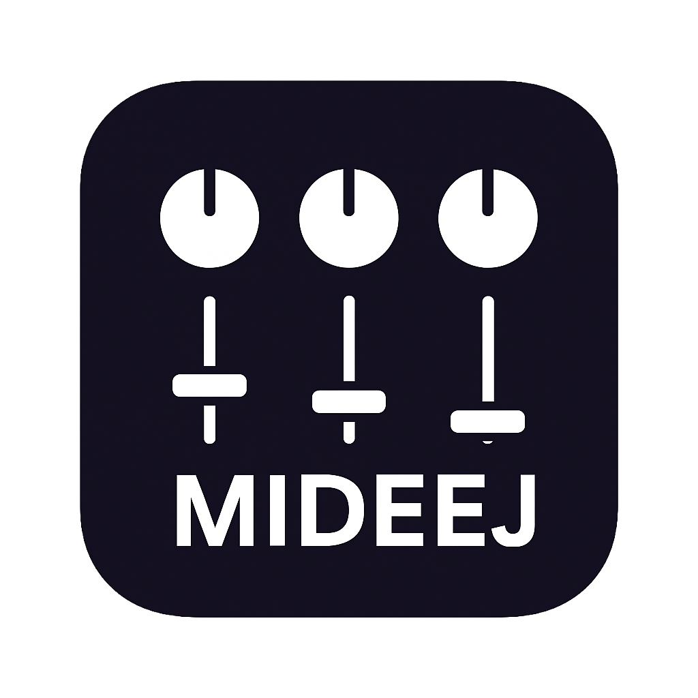

# Mideej

<p align="center">
  
</p>

A powerful MIDI to Windows audio mixer controller for .NET9. Mideej lets you control Windows application volumes and audio routing using MIDI controllers like faders, knobs, and buttons.

## Features

- 🎛️ Multi-Channel Control: Up to 8 simultaneous audio channels with individual volume control
- 🎹 MIDI Controller Support: Works with any MIDI device (tested with M-Vave SMC Mixer, Behringer X-Touch Mini, Novation Launchpad)
- 🎚️ Real-time Fader Control: Smooth, responsive volume control with visual feedback
- 🔇 Mute & Solo: Quick mute and solo buttons for each channel with LED feedback
- 📱 Audio Application Mapping: Assign any Windows audio application to any channel
- 🔁 Exclusive Session Assignment: A session can be assigned to only one channel at a time (reassignment removes it from others)
- ⏯️ Transport Controls: Map Play/Pause, Previous, and Next to controller buttons with LED feedback
- 🔁 Default Device Switching: Quickly swap Windows default Output/Input devices from the controller
- 🔆 LED Feedback Lifecycle: Startup animation (SMC), state restore on connect, and clean LED shutdown on exit
- 🎨 Modern UI: Themeable WPF UI with multiple built-in themes
- 🔌 Hot-plugging: Connect and disconnect MIDI devices on the fly
- 💾 Controller Presets: Pre-configured mappings for popular MIDI controllers
- ⚡ High Performance: Built on .NET9 for optimal performance and low latency

## Screenshots

### Main Interface


### Audio Session Mapping


### Settings


### Edit Mappings


## Running on a small1920x480 screen in fullscreen mode


https://github.com/user-attachments/assets/5d78b155-1a26-405c-a27e-e7a0cd616414


## Requirements

- Windows10 version1809 (build17763) or later
- .NET9.0 Runtime (Desktop)
- A MIDI controller (physical or virtual)

## Installation

### From Release

1. Download the latest release from the Releases page
2. Extract the archive to a folder of your choice
3. Run `Mideej.exe`

### Building from Source

1. Clone the repository:
 ```bash
 git clone https://github.com/jimmyeao/Mideej.git
 cd Mideej
 ```

2. Build the project:
 ```bash
 dotnet build -c Release
 ```

3. Run the application:
 ```bash
 dotnet run
 ```

## Getting Started

###1. Connect Your MIDI Controller

1. Plug in your MIDI controller via USB
2. Launch Mideej
3. Pick your device from the MIDI Device dropdown and click Connect
4. For M‑Vave SMC: a short LED startup animation plays, then LEDs reflect the current state

###2. Map Audio Applications to Channels

1. Click the gear icon (⚙️) on any channel
2. Select one or more active audio applications or devices
3. Channel names update to show the selection
4. Session assignment is exclusive: assigning a session to a channel removes it from any other channel

###3. Configure MIDI Mappings

- Volume: Map faders/knobs (CC or pitch-bend faders)
- Buttons: Map Mute, Solo, Record, Select to Note buttons
- Transport (global): Map Play/Pause, Next, Previous (Notes or CC)
- Note: Cycle Session mapping is no longer supported via MIDI

Open Manage Mappings to review/remove mappings. Mappings persist in your settings.

###4. Control Your Audio

- Faders/Knobs: Adjust application volume (0–100%)
- M button: Mute/unmute the channel (LED reflects state)
- S button: Solo the channel (muting others; LED reflects state)
- Record button (devices only): See “Default Device Switching” below
- Select button LED: See “Select LED (Audio Activity)” below

## Default Device Switching (Output/Input)

You can switch the Windows default playback/recording device directly from mapped channels:

- Assign an Output device (speaker) or Input device (microphone) session to a channel
- Press that channel’s Record button to set it as the Windows default
- The Record LED lights on the channel that represents the current default device
- On startup/connect, Mideej detects and lights the current defaults automatically

Notes:
- Pressing Record on application/system sessions does nothing
- Switching default devices turns off the LED on the previous default’s channel and turns it on for the new one

## Select LED (Audio Activity)

- The Select button LED indicates recent audio activity on a channel
- It turns on when the channel’s assigned sessions have audio above a tiny threshold
- It turns off automatically ~500ms after activity stops
- The Select button itself is read-only in Mideej (presses are ignored). It’s used purely as an activity indicator

## Transport Controls and LEDs

- Play/Pause: Both mapped Play and Pause buttons toggle between states
- LEDs: Play LED is on when playing; Pause LED is on when paused
- Next/Previous: LEDs blink briefly on press

## LED Lifecycle

- On connect/startup:
 - M‑Vave SMC devices run a short LED animation
 - All mapped LEDs are then restored to reflect current states (Mute, Solo, Select, Transport, default device Record)
- On disconnect/exit:
 - Mideej sends All Sound Off / Reset All Controllers / All Notes Off and explicitly turns off mapped LEDs
 - SMC-specific note ranges are also cleared so the panel is dark after exit

## Supported Controllers

Includes presets for:
- M‑Vave SMC Mixer:8-channel controller with LED buttons (tested)
- Behringer X‑Touch Mini: Encoders + buttons (untested)
- Novation Launchpad: Grid controller (untested)

Custom controllers are supported via learning and saved automatically.

## Configuration Files

Controller presets live in `ControllerPresets/` as JSON. You can create your own by copying an existing preset.

Example (simplified):
```json
{
 "ControllerName": "Your Controller",
 "Channels": [
 { "ChannelNumber":1, "FaderCC":0, "MuteNote":16, "SoloNote":32 }
 ]
}
```

## Technology Stack

- .NET9.0, WPF
- CommunityToolkit.MVVM
- NAudio (audio/MIDI)

## Contributing

PRs welcome.

## License

See LICENSE.txt.

## Support

Open an issue if you hit problems or have ideas.
